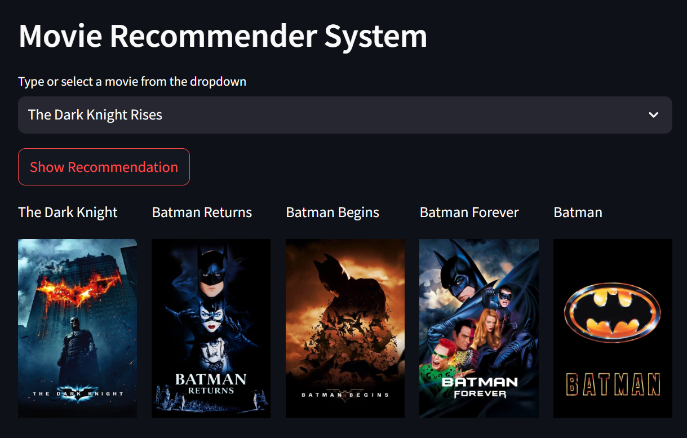

# Movie Recommender System



**Movie Recommender System** built with Python and Streamlit, utilizing TF-IDF vectorization and cosine similarity to recommend movies based on user input.

## Features

- **Movie Recommendations**: Suggests 5 similar movies based on the selected movie.
- **Poster Fetching**: Displays posters of recommended movies using TMDb API.
- **Efficient Loading**: Supports loading large models in chunks to handle memory constraints.
- **User Interface**: Simple and interactive UI built with Streamlit.

## Installation

1. Clone the repository:

   ```bash
   git clone https://github.com/kayush8/movie-recommendation-system.git
   cd movie-recommendation-system
   ```

2. Create a virtual environment:

   ```bash
   python3 -m venv env
   source env/bin/activate  # For Linux/Mac
   env\Scripts\activate   # For Windows
   ```

3. Install dependencies:

   ```bash
   pip install -r requirements.txt
   ```

4. Add your TMDb API key:

   - Replace the placeholder `API_KEY` in the `app.py` file with your API key from [The Movie Database (TMDb)](https://www.themoviedb.org/).

5. Ensure the `models` folder contains the chunked model files (`movies` and `similarity`).

## Usage

1. Run the Streamlit app:

   ```bash
   streamlit run app.py
   ```

2. Select a movie from the dropdown and click **Show Recommendation** to view similar movies along with their posters.

## Project Structure

```
.
├── app.py                # Main application file
├── models/               # Folder containing chunked model files
├── requirements.txt      # Python dependencies
├── README.md             # Project documentation
└── demo_screenshot.png   # Optional screenshot for the demo
```

## Data Preparation

- The recommendation system uses the `tmdb_5000_movies.csv` and `tmdb_5000_credits.csv` datasets for preprocessing.
- The preprocessed data (`movies.pkl` and `similarity.pkl`) are saved in chunks inside the `models` folder.

## Contributing

Contributions are welcome! Please fork the repository and create a pull request for any features or bug fixes.

## License

This project is licensed under the MIT License. See the LICENSE file for details.

## Acknowledgments

- [Streamlit](https://streamlit.io/)
- [The Movie Database (TMDb)](https://www.themoviedb.org/)

---
